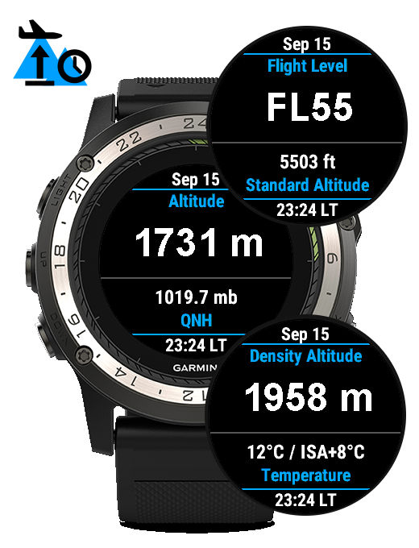

PilotAltimeter (Garmin ConnectIQ) Widget
========================================
Pilot ICAO/ISA Altimeter for Garmin ConnectIQ devices

   

PilotAltimeter is a Garmin ConnectIQ Widget that displays:
 - QNH-based altitude (based on user-specified QNH)
 - QNE-based altitude (flight level)
 - AGL height (based on user-specified reference elevation)
 - Density Altitude (based on actual pressure/temperature)
 - QFE pressure

All of it using your device's raw barometric sensor values (NOT the altitude
computed by the device itself) and conversion formulas as defined by the
International Civial Aviation Organization (ICAO) and according to the
International Standard Atmosphere (ISA).

Build, Installation and Usage
-----------------------------

Please refer to the INSTALL and USAGE files.

